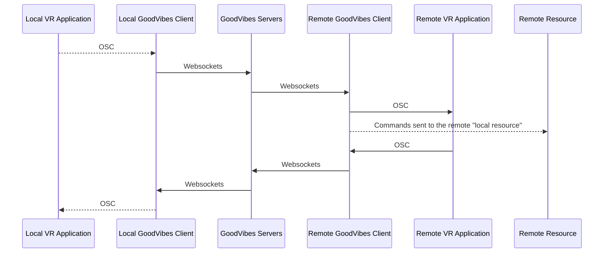
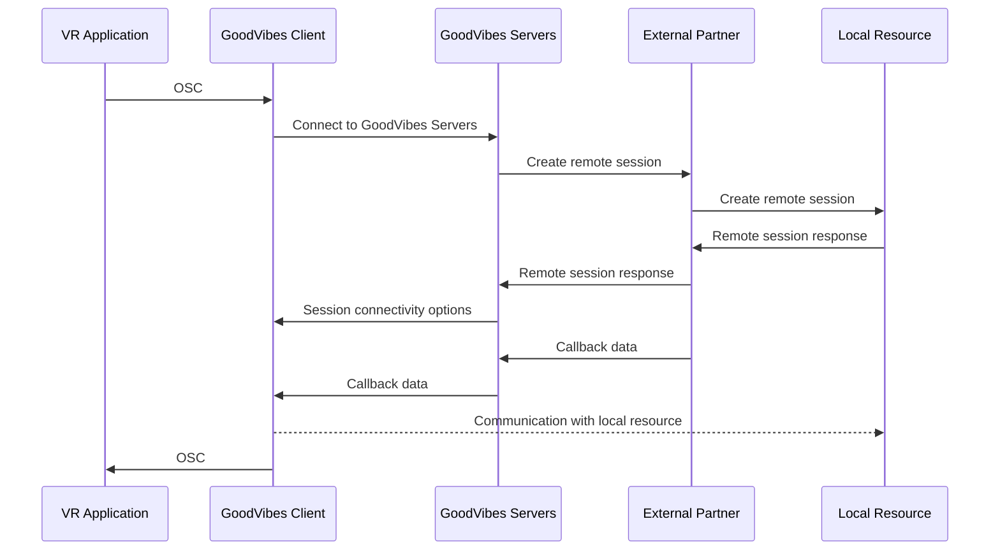

# GoodVibes.Client
GoodVibes Client is a dynamic OSC mapper for certain VR-game(s) that enables Lovense and PiShock control. 

## How does GoodVibes work?
GoodVibes communicates with certain popular social VR-game(s) that support [OSC](https://opensoundcontrol.stanford.edu/index.html). With the easy to understand UI it uses OSC to dynamically synchronize states with your available adult toys.

All toys added to the GoodVibes application have exposed functions that can be mapped to avatar parameters.

### Lovense
GoodVibes implements the [Lovense Standard API](https://developer.lovense.com/#standard-api) to automatically synchronize and control your toys directly from the Lovense Remote app on either your phone or your PC. 

As of *2022-08-04* GoodVibes supports all available Lovense toys

_With the current limitations on Lovense side using your phone requires your phone to be connected to a wifi accessible from the computer running GoodVibes._

### PiShock
GoodVibes implements the [PiShock API](https://apidocs.pishock.com/) to enable control to your PiShock toys.

As of *2022-08-04* GoodVibes only supports PiShock and not PiVault.

## How to download and run GoodVibes
* All you need to do to download GoodVibes is to head over to the [Releases](https://github.com/GoodVibesVR/goodvibes.client/releases) page here on Github and download the latest release.
_If you're not a developer I'd recommend you to download the selfcontained .zip_
* Unzip the zip file somewhere on your computer and open the file _GoodVibes.exe_
* You're now ready to vibe!

## Help and support
Are you having issues? 
Want to support or contribute the project? 
Want to hang out? 

Please head over to our [Discord](https://discord.gg/R2tTCB7MNC).

## Flow diagram
Our application design allows us to make many kinds of integrations. Below are a few sequence diagrams over how integrations can look.

### GoodVibes Remote Control
Communication between GoodVibes clients is enabled using websockets and can either be controlled directly in the local GoodVibes client or mapped to parameters in OSC. These can be used to either control local resources at the receiving end or sync to the VR Application using OSC.

### External service partner control
Below is an example of a bit more complex flow integrating with an external partner then providing us with the callback information that enables our connectivity to their control application.

