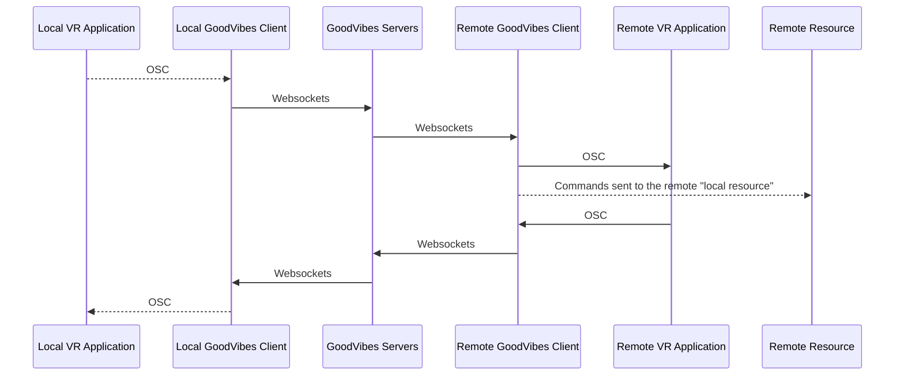
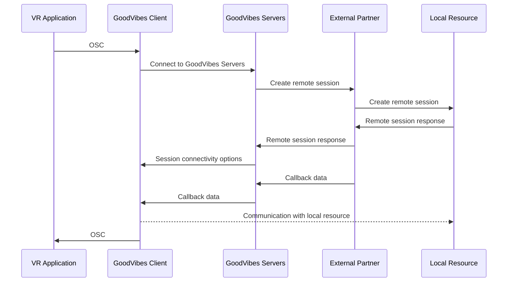

# GoodVibes.Client
GoodVibes client is the locally running client of the GoodVibes ecosystem. The GoodVibes client uses OSC and websockets to synchronize parameters and control external toys such as Lovense.

## Flow diagram

Our service design allows us to make many kinds of integrations. Below is a few sequence diagrams over how integrations can look.

### GoodVibes Remote Control
Communication between GoodVibes clients is enabled using websockets and can either be controlled directly in the local GoodVibes client or mapped to parameters in OSC. These can be used to either control local resources at the receiving end or sync to the VR Application using OSC.

### External service partner control
Below is an example of a bit more complex flow integrating with an external partner then providing us with the callback information that enables our connectivity to their control application.
